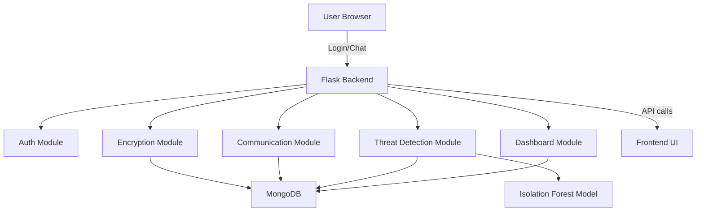

# Architecture Diagram

The system uses a layered architecture with the following components:

- Frontend UI
  - Login/Register
  - Dashboard
  - Secure Chat
  - Admin Panel

- Flask Backend
  - Authentication Module
  - Encryption Module
  - Communication Module
  - AI Threat Detection Module
  - Dashboard Analytics Module

- Database
  - MongoDB stores users, messages, alerts, network logs, and encryption metadata.

- AI Model Training
  - Isolation Forest model trained on NSL-KDD features
  - Model persists to disk for runtime threat detection

## Deployment Flow
1. User logs in via authentication service.
2. Sender encrypts message and backend stores encrypted payload.
3. Threat detector evaluates network traffic and flags anomalies.
4. Dashboard renders analytics and alert cards.
5. Admin reviews suspicious activity and logs.

## Diagram

