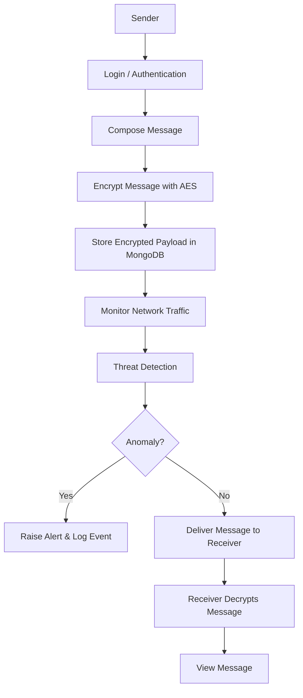

# System Flowchart

This flowchart represents the main workflow for sending a secure message with threat monitoring:

```mermaid
flowchart TD
    A[Sender] --> B[Login / Authentication]
    B --> C[Compose Message]
    C --> D[Encrypt Message with AES]
    D --> E[Store Encrypted Payload in MongoDB]
    E --> F[Monitor Network Traffic]
    F --> G[Threat Detection]
    G --> H{Anomaly?}
    H -->|Yes| I[Raise Alert & Log Event]
    H -->|No| J[Deliver Message to Receiver]
    J --> K[Receiver Decrypts Message]
    K --> L[View Message]
```
